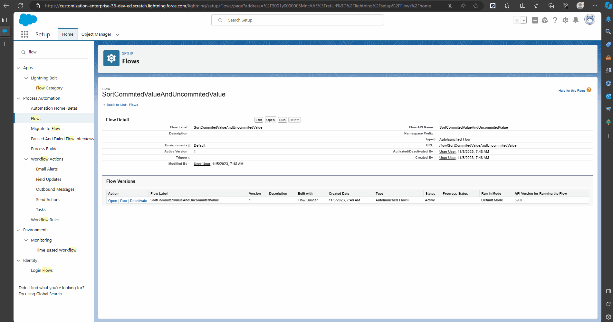

# Description
This repository has been prepared to reproduce GACK errors that occur when running flows using Salesforce Platform features.

After the errors have been resolved, this repository will be archived.
# Requirements
- Git Bash(Only Windows)
- bash or zsh(Not Windows)
- Salesforce CLI
  ```
  $ sf version
  @salesforce/cli/2.13.9 win32-x64 node-v18.15.0
  ```
# Issue Procedure
## Setup
1. Authorize Your DevHub Org using the salesforce cli.

   If you have already authorized a DevHub Org, this process can be skipped. 
   ```
   $ sf auth web login --alias <<YOUR DEVHUB ORG ALIAS>>
   ```
1. Create a Scratch Org.
   ```
   $ sf org create scratch \
     --definition-file ./config/project-scratch-def.json \
     --wait 10 \
     --alias <<YOUR SCRATCH ORG ALIAS>> \
     --target-dev-hub <<YOUR DEVHUB ORG USERNAME OR ALIAS>>
   ```
1. Deploy metadata to the Scratch Org.
   ```
   $ sf project deploy start --target-org <<YOUR SCRATCH ORG ALIAS>>
   ```
1. Execute an apex class to create test records on the Scratch Org.
   ```
   $ sf apex run \
     --file ./scripts/apex/insertTestRecords.apex \
     --target-org <<YOUR SCRATCH ORG ALIAS>>
   ```
1. Open the Scratch Org.
   ```
   $ sf org open --target-org <<YOUR SCRATCH ORG ALIAS>>
   ```

When the above steps are completed, sObjects with created test data and a flow with an issue will be created on the Scratch Org.
- SortCommittedValueAndUncommittedValue : Causing the GACK Error when executing from the Salesforce.com window.
- UnSortCommittedValueAndUncommittedValue : Not causing the GACK Error.
## Execute Flow
Executing flow from Apex is not error. 
```
$ sf apex run --file ./scripts/apex/callflow.apex --target-org <<YOUR SCRATCH ORG ALIAS>>
```

Running or debugging the "SortCommittedValueAndUncommittedValue" Flow on Salesforce.com window is failing!

